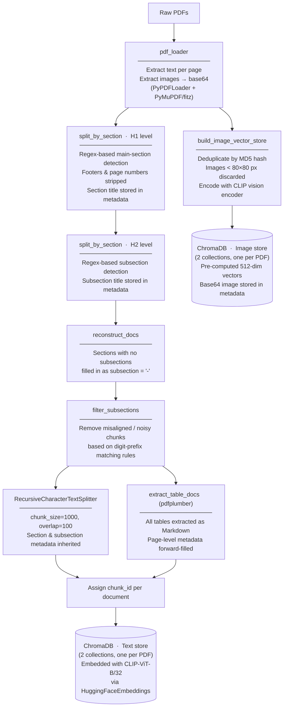
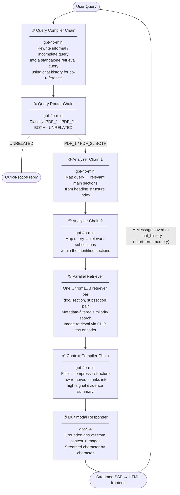

# Linear Workflow RAG — Minimum Viable Product

> A **Retrieval-Augmented Generation (RAG)** system for Singapore Consumer Product Safety documents, featuring hierarchical section-aware chunking, multimodal retrieval (text, image, table), and a stateful multi-turn chat interface served over a FastAPI backend.

---

## Table of Contents
1. [Overview](#overview)
2. [Architecture](#architecture)
   - [Phase 1 — Ingestion](#phase-1--ingestion)
   - [Phase 2 — Retrieval](#phase-2--retrieval)
3. [Key Characteristics](#key-characteristics)
4. [Tech Stack](#tech-stack)
5. [Project Structure](#project-structure)
6. [Setup & Usage](#setup--usage)
7. [Demo Queries](#demo-queries)
8. [Contributors](#contributors)

---

## Overview

This project implements a **minimum viable RAG pipeline** over two Singapore government PDF documents:

| Document | Purpose |
|---|---|
| *CPSA+ Guidebook for Registered Suppliers* | System procedures, application steps, navigation |
| *Consumer Protection (Safety Requirements) Regulations* | Legal requirements, safety standards, definitions |

Users interact through a browser-based chat UI. Each query triggers a **deterministic, sequential multi-chain pipeline** that routes the query, narrows it down to the relevant document sections, retrieves grounded evidence (text, tables, images), compresses the context, and streams a final response — all without hallucinating outside the provided documents.

---

## Architecture

### Phase 1 — Ingestion

Runs **once** on first startup. Results are persisted to disk (ChromaDB + `heading_structure.json`); subsequent startups skip ingestion entirely.



> The section → subsection → chunk hierarchy is preserved entirely in **metadata** (`section`, `subsection`, `chunk_id`). This enables precise metadata-filtered retrieval downstream and is the core of the *section-aware* design.

---

### Phase 2 — Retrieval

Triggered on every user message. The pipeline is **strictly sequential** — each chain's output becomes the next chain's input.



**Memory model:**
| Component | Scope | Purpose |
|---|---|---|
| `chat_history` | Session-wide | Short-term memory — past user/AI turns fed to Query Compiler for co-reference resolution |
| `WorkingMemory` | Per-turn scratchpad | Stores intermediate chain outputs (compiled query, route, sections, retrieved chunks, compiled context); reset each turn |

---

## Key Characteristics

### Hierarchical Section-Aware Chunking
Documents are split top-down: page → main section (H1) → subsection (H2) → fine-grained chunk. Every chunk carries `{section, subsection, chunk_id}` metadata. Retrieval is scoped to the exact `(section, subsection)` pairs identified by the analyzer chains, eliminating cross-section noise.

### Multimodal-Capable Retrieval
Three content modalities are indexed and retrieved:
- **Text** — section/subsection-aware prose chunks
- **Structured tables** — converted to Markdown by `pdfplumber`, stored with page-level metadata
- **Images** — encoded by the CLIP vision encoder; retrieved via CLIP's shared text–image embedding space (a text query vector is compared directly against image vectors)

### Cost-Effective Model Strategy
| Role | Model | Reason |
|---|---|---|
| Query Compiler, Router, Analyzers, Context Compiler | `gpt-4o-mini` | Text-only, low token count, high call frequency |
| Multimodal Responder | `gpt-5.4` | Vision capability required for image reasoning; called once per turn |

### Stateful Multi-Turn Conversation
The Query Compiler receives the full `chat_history` on every turn. This allows it to resolve follow-up references (e.g., *"what about the fee?"* → *"What is the fee for SDoC application?"*) without the user re-stating context. The session resets on page refresh; no database persistence is needed.

### Deterministic Sequential Pipeline
The workflow is a fixed linear chain of five specialized LLM roles plus one rule-based parallel retriever. There is no agent loop, no tool-calling, and no branching except for the UNRELATED guard. This makes the system predictable, debuggable, and straightforward to extend.

---

## Tech Stack

**Backend**
| Component | Library |
|---|---|
| LLM chains & orchestration | LangChain (`langchain`, `langchain-openai`, `langchain-community`) |
| Vector database | ChromaDB (`langchain-chroma`) |
| LLM API | OpenAI (`gpt-4o-mini`, `gpt-5.4`) via `langchain-openai` |
| Text embeddings | `HuggingFaceEmbeddings(model_name="clip-ViT-B-32")` (`langchain-huggingface`) |
| Image embeddings | `SentenceTransformer("clip-ViT-B-32")` (`sentence-transformers`) |
| PDF text extraction | `PyPDFLoader` (`langchain-community`), `PyMuPDF/fitz` |
| Table extraction | `pdfplumber` |
| Image decoding | `Pillow` |

**Bridge API**
| Component | Library |
|---|---|
| REST API + SSE streaming | FastAPI + Uvicorn |

**Frontend**
| Component | Technology |
|---|---|
| Chat UI | HTML + Vanilla JavaScript |
| Markdown rendering | `marked.js` (CDN) |

---

## Project Structure

```
.
├── RAG_pipeline.py                          # Full backend: ingestion, chains, Assistant class
├── main.py                                  # FastAPI server (serves UI + /chat SSE endpoint)
├── frontend.html                            # Single-page chat UI
├── A2_34_.ipynb                             # Development notebook with all unit tests
├── Data_Ingestion_and_Vector_Storage_Workflow.png  # Ingestion architecture diagram
├── requirements.txt                         # Python dependencies
├── .gitignore
│
├── CPSA+_Guidebook_for_Registered_Suppliers.pdf        # Source document (download below)
├── Consumer_Protection_Safety_Requirements_Regulations.pdf  # Source document (download below)
│
├── my_text_db/          # Auto-generated — ChromaDB text+table store (gitignored)
├── my_image_db/         # Auto-generated — ChromaDB image store (gitignored)
└── heading_structure.json  # Auto-generated — cached document index (gitignored)
```

---

## Setup & Usage

### 1. Prerequisites

- Python 3.10+
- An OpenAI API key

### 2. Clone the repository

```bash
git clone https://github.com/<your-username>/<repo-name>.git
cd <repo-name>
```

### 3. Install dependencies

```bash
pip install -r requirements.txt
```

### 4. Download the source PDFs

The PDFs are not committed to the repository due to their size. Download them with `gdown`:

```bash
pip install gdown
gdown 1YOdXcH1OQVi8vhPEDsGFu12G49vvRXSF --output "CPSA+_Guidebook_for_Registered_Suppliers.pdf"
gdown 1QBrBISYCr8JIcVZw8QmTZhOj5zuMy_z4 --output "Consumer_Protection_Safety_Requirements_Regulations.pdf"
```

### 5. Set your API key

```bash
# Windows (PowerShell)
$env:OPENAI_API_KEY = "sk-..."

# macOS / Linux
export OPENAI_API_KEY="sk-..."
```

### 6. Start the server

```bash
python main.py
```

On **first run**, the ingestion pipeline will execute automatically (typically 5–15 minutes depending on hardware). Subsequent starts load from the persisted ChromaDB stores and are near-instant.

Open `http://localhost:8000` in your browser.

---

## Demo Queries

The following queries are designed to exercise each capability of the system:

| Query | Capability demonstrated |
|---|---|
| `My name is Steven.` | Session initialisation |
| `How are you? What can you do for me?` | Greeting handling (out-of-domain) |
| `What is my name?` | Multi-turn co-reference — short-term memory recall |
| `What is UTAR?` | Out-of-scope guard — router correctly returns UNRELATED |
| `What are the list of documents to be included in the Technical File?` | Structured table retrieval |
| `What does the CPSA+ dashboard look like after logging in?` | Image retrieval + visual reasoning |
| `What information is shown on the Allocated Certification Number screen?` | Image retrieval + visual reasoning |

---

## Contributors

| Name | 
|---|---|
| [@limqing](https://github.com/limqing2004) |
| [@]() | 


---

## License

This project was developed as part of UCCD3133 Assignment 2. All source documents are publicly available from the Singapore Consumer Product Safety Office.
