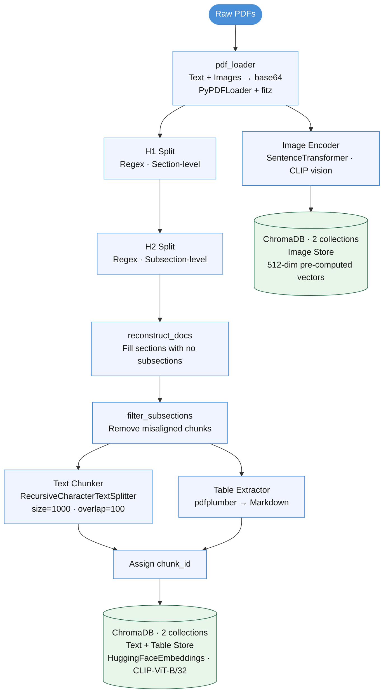
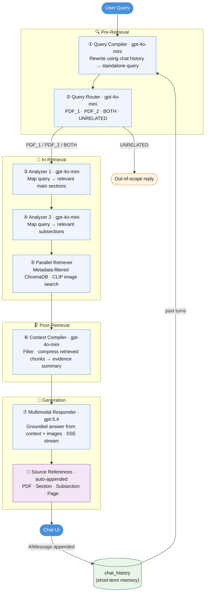

# Multimodal Section-Aware RAG Pipeline

> A **Retrieval-Augmented Generation (RAG)** system for Singapore Consumer Product Safety pdf documents, featuring hierarchical section-aware chunking, multimodal retrieval (text, image, table), source-referenced responses, and a stateful multi-turn chat interface served over a FastAPI backend.

---

## Table of Contents
1. [Overview](#overview)
2. [Architecture](#architecture)
   - [Phase 1 — Ingestion](#phase-1--ingestion)
   - [Phase 2 — Retrieval](#phase-2--retrieval)
3. [Tech Stack](#tech-stack)
4. [Key Characteristics](#key-characteristics)
5. [Project Structure](#project-structure)
6. [Setup & Usage](#setup--usage)
7. [Demo Queries](#demo-queries)
8. [Contributors](#contributors)

---

## Overview

This project implements a **minimum viable RAG pipeline** over two Singapore government PDF documents:

| Document | Purpose |
|---|---|
| *CPSA+ Guidebook for Registered Suppliers* | System procedures, application steps, navigation |
| *Consumer Protection (Safety Requirements) Regulations* | Legal requirements, safety standards, definitions |

Users interact through a browser-based chat UI. Each query triggers a **deterministic, sequential multi-chain pipeline** that routes the query, narrows it down to the relevant document sections, retrieves grounded evidence (text, tables, images), compresses the context, and streams a final response — all without hallucinating outside the provided documents.

---

## Architecture

### Phase 1 — Ingestion

Runs **once** on first startup. Results are persisted to disk (ChromaDB + `heading_structure.json`); subsequent startups skip ingestion entirely.

<u>**RAG pipeline diagram**</u>



> The section → subsection → chunk hierarchy is preserved entirely in **metadata** (`section`, `subsection`, `chunk_id`). This enables precise metadata-filtered retrieval downstream and is the core of the *section-aware* design.

---

### Phase 2 — Retrieval

Triggered on every user message. The pipeline runs through four stages — each stage's output feeds the next.



**Chain roles:**
| # | Chain | Model | Role |
|---|---|---|---|
| ① | Query Compiler | `gpt-4o-mini` | Rewrites the raw user input into a formal, standalone retrieval query — resolves co-references (e.g. *"what about the fee?"*) using `chat_history` |
| ② | Query Router | `gpt-4o-mini` | Classifies the compiled query to `PDF_1`, `PDF_2`, `BOTH`, or `UNRELATED` to scope retrieval to the correct document(s) |
| ③ | Analyzer 1 | `gpt-4o-mini` | Maps the query to the relevant **main sections** from the pre-built heading structure index |
| ④ | Analyzer 2 | `gpt-4o-mini` | Narrows down to the relevant **subsections** within the sections identified in ③ |
| ⑤ | Parallel Retriever | Rule-based | Fires one metadata-filtered ChromaDB retriever per `(doc, section, subsection)` triple; additionally retrieves images via CLIP text-to-image search |
| ⑥ | Context Compiler | `gpt-4o-mini` | Filters, deduplicates, and compresses raw retrieved chunks into a concise, high-signal evidence summary |
| ⑦ | Multimodal Responder | `gpt-5.4` | Generates a grounded answer from the evidence summary and retrieved images; response is streamed character-by-character via SSE |

**Memory model:**
| Component | Scope | Purpose |
|---|---|---|
| `chat_history` | Session-wide | Short-term memory — past user/AI turns fed to Query Compiler for co-reference resolution |
| `WorkingMemory` | Per-turn scratchpad | Stores intermediate chain outputs (compiled query, route, sections, retrieved chunks, compiled context); reset each turn |

---

## Tech Stack

**Backend**
| Component | Library |
|---|---|
| LLM chains & orchestration | LangChain (`langchain`, `langchain-openai`, `langchain-community`) |
| Vector database | ChromaDB (`langchain-chroma`) |
| LLM API | OpenAI (`gpt-4o-mini`, `gpt-5.4`) via `langchain-openai` |
| Text embeddings | `HuggingFaceEmbeddings(model_name="clip-ViT-B-32")` (`langchain-huggingface`) |
| Image embeddings | `SentenceTransformer("clip-ViT-B-32")` (`sentence-transformers`) |
| PDF text extraction | `PyPDFLoader` (`langchain-community`), `PyMuPDF/fitz` |
| Table extraction | `pdfplumber` |
| Image decoding | `Pillow` |

**Bridge API**
| Component | Library |
|---|---|
| REST API + SSE streaming | FastAPI + Uvicorn |

**Frontend**
| Component | Technology |
|---|---|
| Chat UI | HTML + Vanilla JavaScript |
| Markdown rendering | `marked.js` (CDN) |

---

## Key Characteristics

### 1. Hierarchical Section-Aware Chunking
Documents are split top-down: page → main section (H1) → subsection (H2) → fine-grained chunk. Every chunk carries `{section, subsection, chunk_id}` metadata. Retrieval is scoped to the exact `(section, subsection)` pairs identified by the analyzer chains, eliminating cross-section noise.

### 2. Multimodal-Capable Retrieval
Three content modalities are indexed and retrieved:
- **Text** — section/subsection-aware prose chunks
- **Structured tables** — converted to Markdown by `pdfplumber`, stored with page-level metadata
- **Images** — encoded by the CLIP vision encoder; retrieved via CLIP's shared text–image embedding space (a text query vector is compared directly against image vectors)

### 3. Cost-Effective Model Strategy
| Role | Model | Reason |
|---|---|---|
| Query Compiler, Router, Analyzers, Context Compiler | `gpt-4o-mini` | Text-only, low token count, high call frequency |
| Multimodal Responder | `gpt-5.4` | Vision capability required for image reasoning; called once per turn |

### 4. Stateful Multi-Turn Conversation
The Query Compiler receives the full `chat_history` on every turn. This allows it to resolve follow-up references (e.g., *"what about the fee?"* → *"What is the fee for SDoC application?"*) without the user re-stating context. The session resets on page refresh; no database persistence is needed.

### 5. Deterministic Sequential Pipeline
The workflow is a fixed linear chain of five specialized LLM roles plus one rule-based parallel retriever. There is no agent loop, no tool-calling, and no branching except for the UNRELATED guard. This makes the system predictable, debuggable, and straightforward to extend.

### 6. Grounded Source References
Every response is automatically followed by a **References** block listing the exact source document, main section, subsection, and page number of every retrieved chunk used to construct the answer. Retrieved images are similarly attributed with their source label and section. This allows users to verify any claim against the original PDFs without manual searching, and reinforces the system's strictly grounded, no-hallucination design.

---

## Project Structure

```
.
├── RAG_pipeline.py                          # Full backend: ingestion, chains, Assistant class
├── main.py                                  # FastAPI server (serves UI + /chat SSE endpoint)
├── frontend.html                            # Single-page chat UI
├── multimodal_rag_pipeline.ipynb                             # Development notebook with all unit tests
├── Data_Ingestion_and_Vector_Storage_Workflow.png  # Ingestion architecture diagram
├── requirements.txt                         # Python dependencies
├── .gitignore
│
├── CPSA+_Guidebook_for_Registered_Suppliers.pdf        # Source document (download below)
├── Consumer_Protection_Safety_Requirements_Regulations.pdf  # Source document (download below)
│
├── my_text_db/          # Auto-generated — ChromaDB text+table store (gitignored)
├── my_image_db/         # Auto-generated — ChromaDB image store (gitignored)
└── heading_structure.json  # Auto-generated — cached document index (gitignored)
```

---

## Setup & Usage

### 1. Prerequisites

- Python 3.10+
- An OpenAI API key

### 2. Clone the repository

```bash
git clone https://github.com/<your-username>/<repo-name>.git
cd <repo-name>
```

### 3. Install dependencies

```bash
pip install -r requirements.txt
```

### 4. Download the source PDFs

The PDFs are not committed to the repository due to their size. Download them with `gdown`:

```bash
pip install gdown
gdown 1YOdXcH1OQVi8vhPEDsGFu12G49vvRXSF --output "CPSA+_Guidebook_for_Registered_Suppliers.pdf"
gdown 1QBrBISYCr8JIcVZw8QmTZhOj5zuMy_z4 --output "Consumer_Protection_Safety_Requirements_Regulations.pdf"
```

### 5. Set your API key

```bash
# Windows (PowerShell)
$env:OPENAI_API_KEY = "sk-..."

# macOS / Linux
export OPENAI_API_KEY="sk-..."
```

### 6. Start the server

```bash
python main.py
```

On **first run**, the ingestion pipeline will execute automatically (typically 5–15 minutes depending on hardware). Subsequent starts load from the persisted ChromaDB stores and are near-instant.

Open `http://localhost:8000` in your browser.

---

## Demo Queries

The following queries are designed to exercise each capability of the system:

| Query | Capability demonstrated |
|---|---|
| `My name is Steven.` | Session initialisation |
| `How are you? What can you do for me?` | Greeting handling |
| `What is my name?` | Multi-turn co-reference — short-term memory recall |
| `What is UTAR?` | Out-of-scope guard — router correctly returns UNRELATED |
| `What are the list of documents to be included in the Technical File?` | Structured table retrieval |
| `What does the CPSA+ dashboard look like after logging in?` | Image retrieval + visual reasoning |
| `What information is shown on the Allocated Certification Number screen?` | Image retrieval + visual reasoning |
| **1)** `I am a new supplier who wants to sell controlled goods in Singapore. What are the legal requirements I need to meet, and how do I register my account and submit my first application in CPSA+?` <br><br> **2)** `If I make changes to a controlled good that is already registered, what are the legal requirements regarding re-registration, and how do I update the product details in CPSA+?` | Cross-document retrieval — spans both PDFs (regulatory + procedural) |

---

## Contributors

<b>Name</b>
1. [Lim Qing](https://github.com/qing123777) 
2. [Law Ying Yee](https://github.com/YY80813)
3. [Chong Zhi Cong](https://github.com/tetsu19991209-blip)

---

## License

All source documents are publicly available from the Singapore Consumer Product Safety Office.
